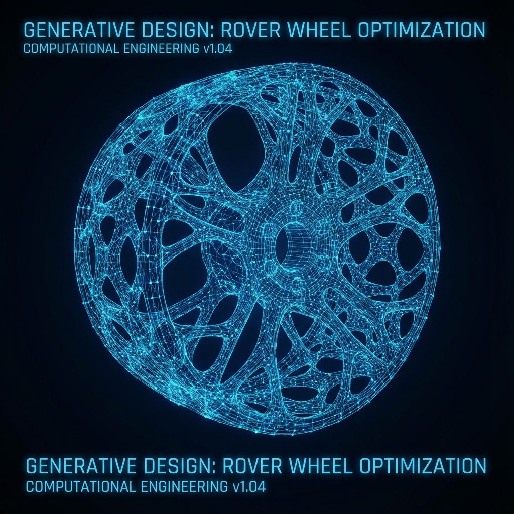
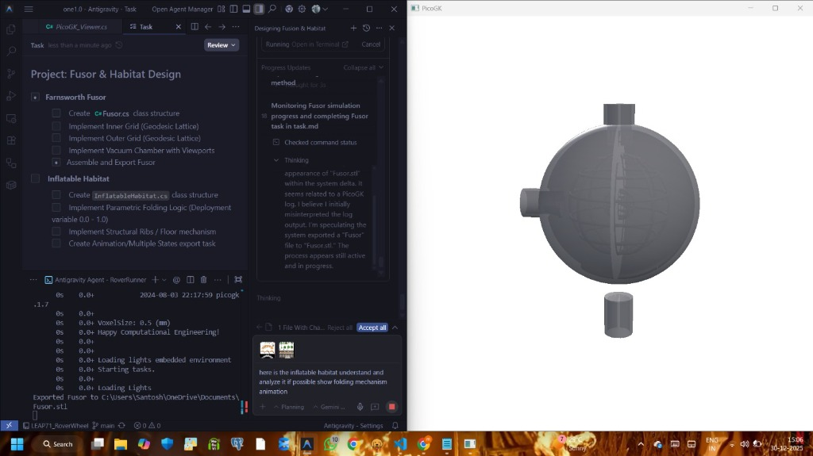
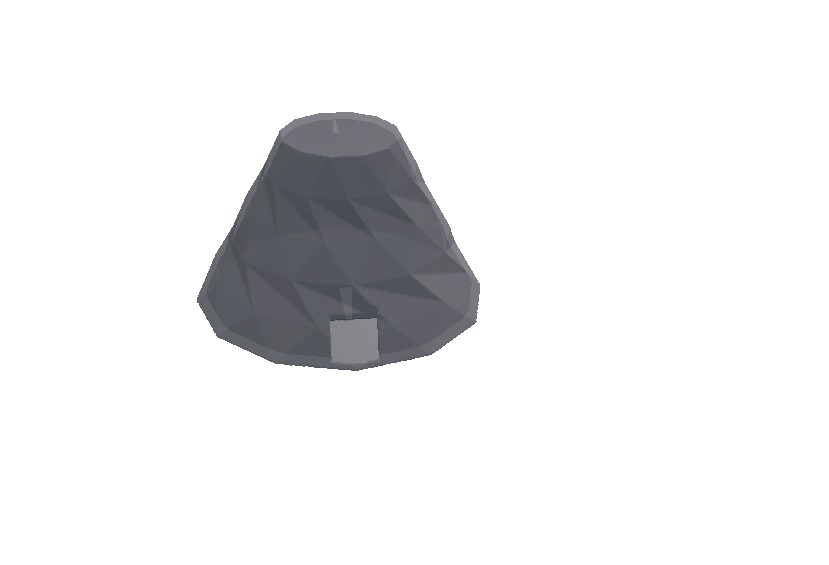
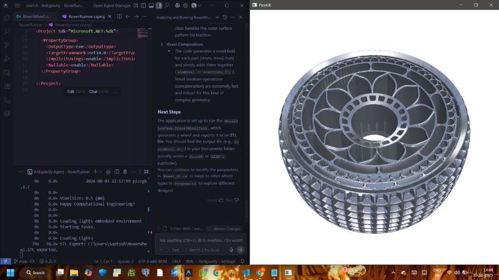
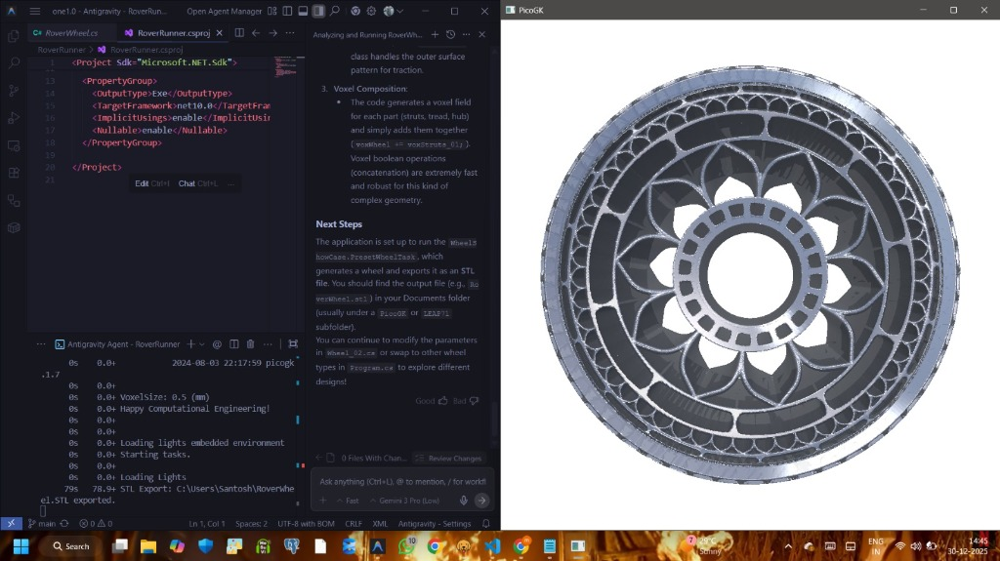

# GenShape: Automotive Intelligent Engineering



## 🚀 Project Overview

GenShape is a cutting-edge **Introduction to Computational Engineering** agent designed to assist automotive engineers in designing, analyzing, and optimizing vehicle components. It represents a paradigm shift from manual CAD drafting to algorithmic, rules-driven engineering. By leveraging advanced geometry kernels, it can procedurally generate unique, performance-driven geometries like monocoque chassis and optimized rover wheels.


## 📊 Project Status

| Metric | Details |
| :--- | :--- |
| **Stage** | 🏗️ **Alpha Prototype** |
| **Phase** | **Core Logic & Geometry Integration** |
| **Current Build** | v1.0.4 |
| **Stability** | Experimental |
| **Focus** | Procedural Generation & Material Analysis |

## 🎯 For Whom?

*   **Automotive Engineers**: To rapidly prototype complex structural components and receive instant DFM (Design for Manufacturing) feedback.
*   **Computational Designers**: To explore the potential of code-driven design (Computational Engineering Models) for functional parts.
*   **Students & Researchers**: To learn about the intersection of Artificial Intelligence, material science, and implicit geometry representations.

## 🛠️ How It Works

The **GenShape System** functions as a pair-programmer for physical objects:

1.  **Conversational Interface**: The user interacts with the agent via a natural language Command Line Interface (CLI). The agent maintains context of the conversation (`IntelligentAgent.cs`).
2.  **Requirements Gathering**: Through a structured dialogue, the agent gathers critical constraints:
    *   *Production Volume* (High vs. Low)
    *   *Safety Criticality* (ISO compliance)
    *   *Material Preferences* (Steel, Aluminum, Composites)
3.  **Knowledge Bank**: It references an internal `EngineeringKnowledgeBank` to provide real-time engineering tips, safety factor adjustments, and material recommendations based on the gathered constraints.
4.  **Geometry Generation**: Using **PicoGK** and **LEAP71_ShapeKernel**, it procedurally generates voxel-based geometry. For example, asking for a "chassis" triggers the `AutomotiveShapes.GenerateMonocoqueChassis_ShapeKernel()` function, which builds a voxel field representing the part.
5.  **Cost Estimation**: It provides rough cost estimates based on weight, material density, and complexity factors.

## 💡 Why It Works

*   **Rule-Based Logic**: By embedding engineering principles directly into the code (`AutomotiveEngineeringLayer`), the agent ensures that generated designs are physically plausible for their intended production scale.
*   **Voxel-Based Geometry**: Utilizing **PicoGK**, the project bypasses the limitations of traditional B-Rep (Boundary Representation) CAD. Voxels allow for:
    *   Complex organic shapes and lattices (ideal for 3D printing).
    *   Boolean operations that never fail.
    *   Robust simulation-ready meshes.
*   **Modular Architecture**: The separation of `IntelligentAgent` (logic) and `AutomotiveShapes` (geometry) allows for easy expansion of the component library without rewriting the core interaction loop.

## 🙏 Special Thanks & Acknowledgements

This project was heavily inspired by and built using the incredible open-source tools provided by **LEAP71**. Their work is pioneering the field of Computational Engineering.

<div align="center">

| **PicoGK** | **ShapeKernel** | **Rover Wheel** |
| :---: | :---: | :---: |
| [🔗 GitHub Repo](https://github.com/leap71/PicoGK) | [🔗 GitHub Repo](https://github.com/Leap71/LEAP71_ShapeKernel) | [🔗 GitHub Repo](https://github.com/leap71/LEAP71_RoverWheel) |
| *The Geometry Kernel* | *The Framework* | *The Inspiration* |

</div>

We specifically thank them for the **PicoGK** engine which powers our voxels, and the **ShapeKernel** which provides the essential geometric primitives. The **Rover Wheel** project served as a prime example of what is possible with this tech stack.

## 📦 Installation & Usage

1.  **Clone the repository**.
2.  **Prerequisites**: Ensure you have the `.NET 8.0 SDK` installed.
3.  **Run**: Execute `dotnet run` in the terminal.
4.  **Interact**: Follow the on-screen prompts to design your automotive component.

---
*Built with ❤️ by the GenShape Team*

## 🖼️ Project Gallery

Here are some snapshots of the system in action, demonstrating the generation of Fusors, Habitats, and intricate Rover Wheels.

<div align="center">

| **Fusor Generation** | **Habitat Concept** |
| :---: | :---: |
|  |  |
| *Simulating a Farnsworth Fusor Grid* | *Deployable Inflatable Habitat Structure* |

| **Rover Wheel (Iso)** | **Rover Wheel (Front)** |
| :---: | :---: |
|  |  |
| *Procedurally Generated Lattice Wheel* | *Optimized Traction Surface Pattern* |

</div>

## 🔧 Technical Deep Dive: Inside the Engine

The power of GenShape lies in its stack: **PicoGK** for geometry and **ShapeKernel** for logic. Here is how they work together to create Physical AI.

### 1. PicoGK: The Voxel Field Geometry Kernel
Traditional CAD uses Boundary Representations (B-Rep), defining objects by their mathematically perfect surfaces. This is often fragile and fails with complex operations (like combining 10,000 struts).

**PicoGK** is different. It uses **Voxels** (Volumetric Pixels).
-   **The Field**: Imagine space as a dense grid. Every point has a value representing its distance to the nearest surface (Signed Distance Field).
-   **Indestructible Boolean Logic**: Adding two objects is just `max(A, B)`. Subtracting is `A - B`. It **never** fails, no matter how complex the geometry.
-   **Micro-Architecture**: This allows us to generate foam-like lattices, gyroids, and organic shapes that are impossible in standard CAD.

### 2. LEAP71 ShapeKernel: The Logic Framework
**ShapeKernel** is the "brain" that sits on top of PicoGK. It turns raw voxels into Engineering Objects.
-   **Parametric DNA**: A part isn't a static file. It is a live `Class`. A `RoverWheel` is a class with properties like `Radius`, `SpokeThickness`, and `PatternType`.
-   **Recursive Composition**: Shapes can contain other Shapes. A `Wheel` contains a `Hub`, `Struts`, and `Tread`, all seamlessly combined.

### ⚙️ Logic Flow Diagram

The following diagram illustrates how a user request transforms into a physical file:

```mermaid
graph TD
    A[User Request: 'Design a Rover Wheel'] -->|Natural Language| B(GenShape IA Agent);
    B -->|Extract Constraints| C{parameters};
    C -->|Radius, Load, Terrain| D[ShapeKernel Class: RoverWheel];
    
    subgraph "Computational Geometry Pipeline"
        D -->|Construct Hub| E[Voxel Field: Hub];
        D -->|Construct Lattices| F[Voxel Field: Struts];
        D -->|Construct Tread| G[Voxel Field: Traction];
        
        E & F & G -->|Boolean Union (+)| H[Combined Voxel Model];
    end
    
    H -->|Slice / Mesh| I[PicoGK Processor];
    I -->|Export| J[Output: STL / CLI / VDB];
```

### Why This Matters?
By moving from **Drawing Lines** to **Writing Code**, we can:
1.  **Automate Complexity**: Generate unique parts for every single vehicle without human effort.
2.  **Embed Engineering**: The code technically prevents valid geometry from effectively violating physics (e.g. by ensuring minimum wall thicknesses automatically).
3.  **Optimize instantly**: Change one line of code to make the wheel 10% lighter, and the entire geometry rebuilds instantly.

