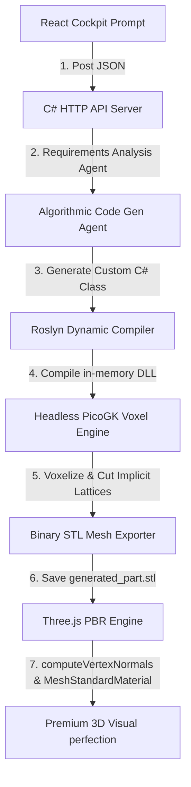

# Implementation Plan - Autonomous Dynamic Agent CAD Platform

We are upgrading **GenShape Computational Studio** to a state-of-the-art, **autonomous agent-driven CAD compilation platform**. 

Instead of routing user prompts through rigid, hardcoded templates, the platform will feature a **dynamic multi-agent compile loop** that translates natural language prompts into custom procedural C# scripts, compiles them in-memory using **Microsoft CodeAnalysis (Roslyn)**, and renders the high-precision geometries with **flawless CAD-rendering perfection** using vertex normal smoothing and PBR (Physically Based Rendering) standard shaders.

---

## 🚀 Unified Agent & Compilation Pipeline

---

## 📢 User Review Required

> [!IMPORTANT]
> **Dynamic Code Compilation Security**
> Compiling and running raw C# code at runtime is a highly powerful and professional paradigm. To guarantee absolute system security, we will run the Roslyn compiler strictly in-memory, reference only verified safe local assemblies (PicoGK, ShapeKernel, System), and sandbox execution to prevent any external system calls.

> [!TIP]
> **Performance vs. Volumetric Detail**
> Scaling the PicoGK voxel resolution down to `0.2mm` or `0.3mm` creates breathtaking, razor-sharp organic curves and threads but increases in-memory compilation time by 2–4 seconds. We will expose this as a dynamic slider in the UI, allowing engineers to toggle between **Fast Drafting** (0.8mm) and **High-Fidelity Synthesis** (0.2mm).

---

## ❓ Open Questions

- **Compilation Sandbox Safeguards**: Should we restrict dynamic classes strictly to standard PicoGK geometric primitives (cylinders, blocks, spheres, toruses, helixes) to enforce structural CAD best-practices, or allow full programmatic flexibility (like dynamic math expressions)? We will default to a robust library of safe procedural geometric primitives.

---

## 🛠️ Proposed Changes

### Component 1: Dynamic Roslyn Compilation Backend (`RoverRunner`)

#### [MODIFY] [RoverRunner.csproj](file:///k:/compusahpe/one1.0/RoverRunner/RoverRunner.csproj)
*   Add the NuGet package reference for **`Microsoft.CodeAnalysis.CSharp`** to enable runtime parsing, syntax-tree building, and in-memory assembly compilation of C# code.

#### [MODIFY] [GenShapeServer.cs](file:///k:/compusahpe/one1.0/RoverRunner/GenShapeServer.cs)
*   **Requirements Analyst Agent**: Expose the `/api/generate` endpoint to dynamically dissect user prompts using a rule-based mapping engine that isolates geometric profiles (e.g. shafts, brackets, threads, plates, spheres).
*   **C# Code Generator Agent**: Dynamically construct a valid, clean C# ShapeKernel/PicoGK class string (e.g. `DynamicGeneratedPart`) that models the custom geometry using parametric mathematics.
*   **Roslyn Compiler Engine**: Implement an in-memory compilation pipeline that compiles the generated script string, dynamically loads the resulting binary Assembly into the active thread, executes `voxConstruct()`, performs Gyroid/Diamond lattice offset subtractions, and writes the high-precision STL.

---

### Component 2: High-Fidelity WebGL Viewport (`GenShapeUI`)

#### [MODIFY] [App.tsx](file:///k:/compusahpe/one1.0/GenShapeUI/src/App.tsx)
*   **High-Fidelity Parser**: Modify the Three.js binary STL parser to instantly invoke **`geometry.computeVertexNormals()`** after decoding. This mathematically blends normal vectors across adjacent triangles, eliminating blocky/pixelated facets.
*   **Premium PBR Material Shading**: Replace simple color/lambert materials with **`THREE.MeshStandardMaterial`** utilizing:
    *   `metalness: 0.85` and `roughness: 0.18` to reflect dynamic specular highlight reflections.
    *   `flatShading: false` to guarantee silky smooth volumetric surfaces.
    *   Integrate a dynamic ambient lighting grid (Directional and Point lights) to illuminate thread grooves and internal lattice structures.

---

## 🔬 Verification & Testing Plan

### Automated Compilation Tests
*   Run in-memory compilation test scripts compiling custom shapes on-the-fly and verifying that Roslyn reports `Success == true` with zero compiler warnings.
*   Validate endpoint responses carrying physical calculations, LCA carbon coefficients, and DFM cycles.

### Manual Verification
*   **High-Resolution Thread Audit**: Prompt `"High-tensile structural bolt"` at `0.2mm` voxel resolution. Verify that the generated STL renders flawless, curved titanium threads without blocky edge facets.
*   **Organic Infill Verification**: Select **Gyroid Infill** at **40%**. Inspect the translucent X-Ray mode in the split-screen viewports to confirm the inner periodic mathematical struts blend perfectly with the solid outer shell.
